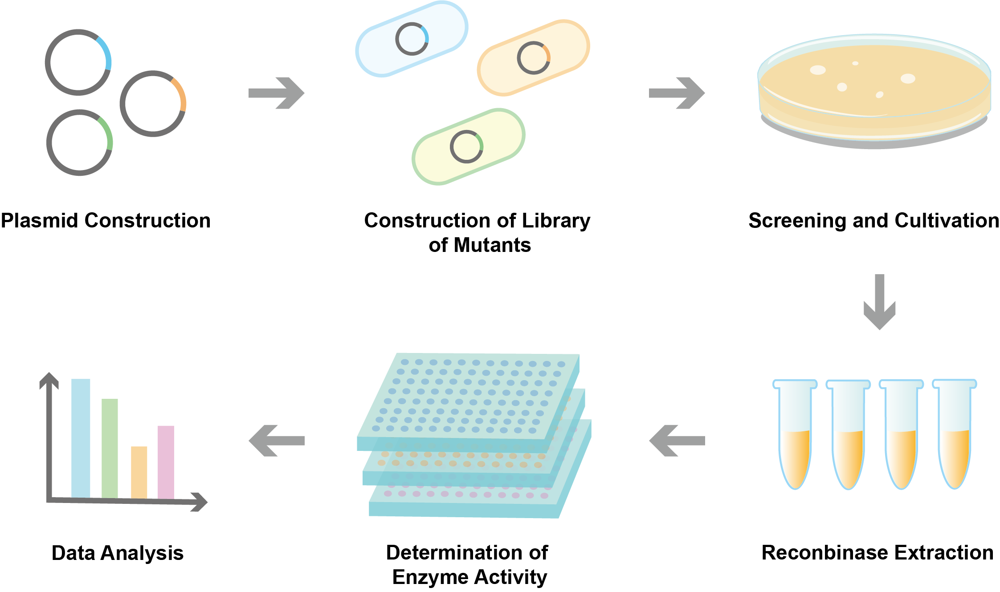
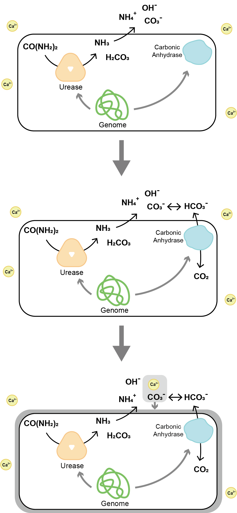

# Background

**Error-prone PCR** 

Error-prone PCR technology has a wide range of applications in vitro random mutation . It is currently the most extensively used in vitro directed evolution of proteins and plays an important role in improving the catalytic properties of enzyme molecules[1-3]. Error-prone PCR has been applied to improve the activity of glucanase, glycosyl trehalose synthase, starch hydrolase, lipase, laccase *β*, cellulase etal. What’s more, it is also very vital in guiding the study of the key amino acid residues that affect the catalytic properties of enzymes[4-9].

**A Biref Introduction of MICP** 

Microbial induced calcium carbonate precipitation (MICP) is a natural phenomenon that microorganisms form calcium carbonate deposits in their surrounding microenvironment through metabolism. As early as 1973, Boquet et al.[10] first discovered the phenomenon of soil microbial induced calcium carbonate precipitation (MICP). Most microorganisms in nature can generate cementation substances through their own metabolic activities, causing cementation between particles[11], thus improving the strength of soil and reducing its water permeability. Microbial cement has the characteristics of environmental protection, economy and efficiency, and has become a research hotspot in the fields of biology, civil engineering and environment. There are two key enzymes for biomineralization, namely urease and carbonic anhydrase[12].
 

{ width=500px }

*Fig.1* <b>How to create more efficient enzymes</b> 

 
**Reaction Principle** 

Urease hydrolyzes urea to increase cell pH and carbonate concentration, forming alkaline conditions for calcium carbonate deposition. When Ca2+ adsorbed on the cell surface meets carbonate ions, it forms calcium carbonate precipitation and eventually biomineralization. Carbonic anhydrases (CA) are zinc containing metalloenzymes that can efficiently catalyze the reversible reactions between carbon dioxide, water, carbonic acid and H+. Carbonic anhydrase can effectively promote biomineralization. In natural conditions, the hydration rate of CO2 is quite low, which greatly limits the generation of calcium carbonate precipitation. However, the CO2 hydration rate increases rapidly when the reaction above is catalyzed by carbonic anhydrase, reaching 108 times that in natural conditions. 

Therefore, the rapid deposition of biologically induced calcium carbonate mineralization requires urease to decompose urea to increase the pH value of the environment, and carbonic anhydrase to promote the rapid hydration of CO2 to form a large amount of CO32–, thus forming calcium carbonate deposition with Ca2+ in the environment[12]. The mineralization and deposition cost of carbonic anhydrase mineralizing bacteria is low, there is no secondary pollution to the environment, and it can effectively store carbon dioxide, which has great potential in the research of environmental engineering fields such as mitigating global warming and other engineering fields[12]. At present, Sporosarcina pasteurii is the strain with the best biomineralization efficiency among known natural bacteria.

{ width=300px }

*Fig.2* <b>A brief description of MICP induced by urease and carbonic anhydrase</b> 

**Our Aims** 

MICP research has been focused on screening strains with higher urease activity[13], in order to quickly produce CO32– by accelerating the decomposition of urea, but the activity of carbonic anhydrase of the strain has been ignored. This study attempts to improve the activity of carbonic anhydrase by means of error-prone PCR to explore the effect of the increase of carbonic anhydrase activity on the mineralization rate of microbial cement.

---

References 

[1] KATARIA A, SHARMA R, SHARMA S, et al. Recent appli-cations of bio-engineering principles to modulate the functionality of proteins in food systems[J]. Trends in Food Science & Technology， 2021，113：54−65. DOI: https://doi.org/10.1016/j.tifs.2021.04.055 

[2] XU Y, WU Y, LV X, et al. Design and construction of novel biocatalyst for bioprocessing: Recent advances and future outlook [J]. Bioresource Technology，2021：125071. DOI: https://doi.org/10.1016/j.biortech.2021.125071 

[3] ZENG W, GUO L, XU S, et al. High-throughput screening technology in industrial biotechnology[J]. Trends in Biotechnolo-gy，2020，38（8）：888−906. DOI: https://doi.org/10.1016/j.tibtech.2020.01.001 

[4] WU H, TIAN X, DONG Z, et al. Engineering of Bacillus amyloliquefaciens α-amylase with improved calcium independence and catalytic efficiency by error-prone PCR[J]. Starch-Stärke，2018，70（3−4）： 1700175. DOI: https://doi.org/10.1002/star.201700175 

[5] GAOL M D F L, SATYA A A, PUSPITASARI E, et al. In-creasing hydrolytic activity of lipase on palm oil by PCR-based ran-dom mutagenesis[J]. International Journal of Oil Palm，2020，3（3）： 78−87. DOI: https://doi.org/10.35876/ijop.v3i3.53 

[6] DAI S, YAO Q, YU G, et al. Biochemical characterization of a novel bacterial laccase and improvement of its efficiency by direct-ed evolution on dye degradation[J]. Frontiers in Microbiology， 2021：12. DOI: https://doi.org/10.3389/fmicb.2021.633004 

[7] SUN Z B, XU J L, LU X, et al. Directed mutation of β -glu-canases from probiotics to enhance enzymatic activity, thermal and pH stability[J]. Archives of Microbiology，2020，202 （7）：1749−1756. DOI: https://doi.org/10.1007/s00203-020-01886-z 

[8] SU L, YAO K, WU J. Improved activity of Sulfolobus acido-caldarius maltooligosyltrehalose synthase through directed evolu-tion[J]. Journal of Agricultural and Food Chemistry，2020，68（15）： 4456−4463. DOI: https://doi.org/10.1021/acs.jafc.0c00948 

[9] BASIT A, TAJWAR R, SADAF S, et al. Improvement in ac-tivity of cellulase Cel12A of Thermotoga neapolitana by error prone PCR[J]. Journal of Biotechnology，2019，306：118−124. DOI: https://doi.org/10.1016/j.jbiotec.2019.09.011 

[10] BOQUET E，BOＲONAT A，ＲAMOS － CO Ｒ MENZANA A ． Produc-tion of calcite ( Calcium carbonate) crystals by soil bacteria is a gen-eral phenomenon［ J ］． Nature ， 1973， 246( 5434) : 527 －529． DOI: https://doi.org/10.1038/246527a0 

[11] SHAH Ｒ OKHI － SHAH Ｒ AKI Ｒ ， O'KELLY B C，NIAZI A，et al．Improving sand with microbial － induced carbonate precipitation ［ J ］． Proceedings of the Institution of Civil Engineers Ground Improve-ment，2015，168( 3) : 1 －14． DOI: https://doi.org/10.1680/grim.14.00001 

[12] WANG L, WANG XX, LI F, CUI MJ, YANG XX, YANG M, YAN YJ. Advances of enzymes related to microbial cement. Chin J. Biotech, 2022, 38(2): 506-517. DOI: https://doi.org/10.13345/j.cjb.210127.

[13] Fujita M, Nakashima K, Achal V, et al. Whole-cell evaluation of urease activity of Pararhodobacter sp.isolated from peripheral beachrock. Biochem Eng J,2017, 124: 1-5. DOI: https://doi.org/10.1016/j.bej.2017.04.004 