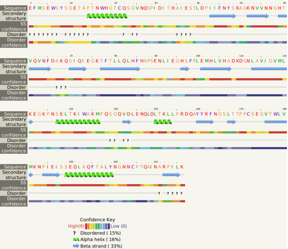
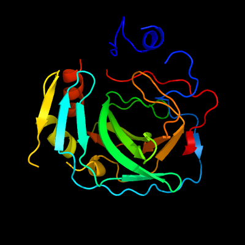
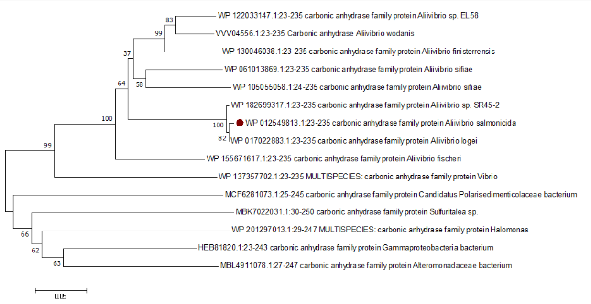
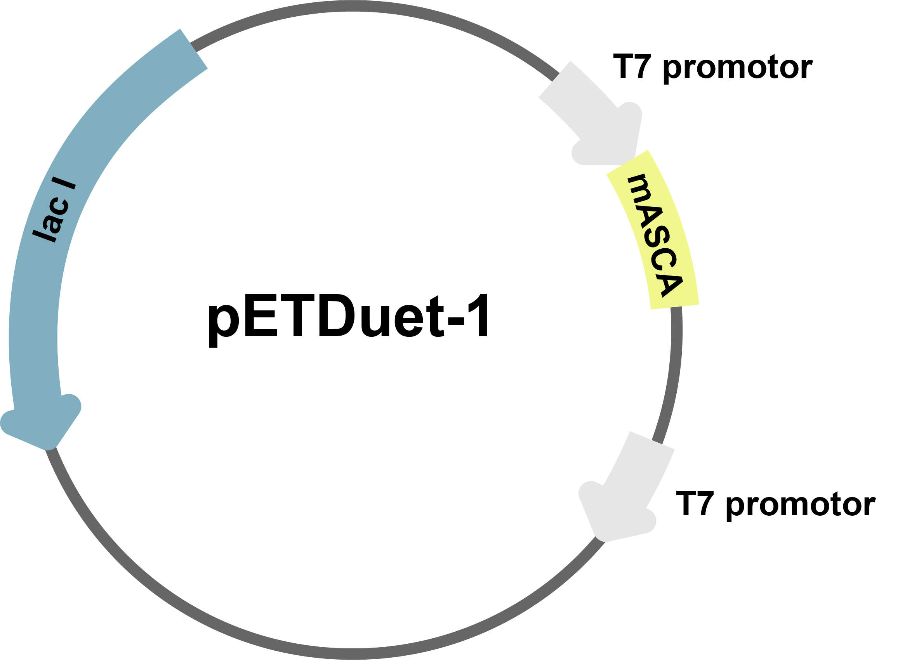

# Bioinformatics analysis of mASCA

<b>1. Secondary structure and analysis of mASCA</b>

The gene sequence analysis of mASCA was conducted with Phyer2 protein structure server, and the optimized carbonic anhydrase gene encodes 216 amino acids. The protein contains a total of 4 alpha helices and 14 beta folded fragments. The prediction results were with high confidence (Fig.1).

{ width=400px }

*Fig.1* <b>Secondary structure of mASCA</b> 

<b>2. Homology modeling and 3D structure prediction of mASCA</b>

The results of homology modeling of mASCA using Phyer2 protein structure server showed 50% sequence identity between the protein and PDB database template c6ekiA and with 100 % confidence level (Fig.2). Since the homology modeling method is based on sequence homology comparison, it is more effective for the simulation of sequences with sequence similarity greater than 30%, and therefore our result has a high confidence level.

<b>3. Evolutionary tree and evolutionary relationship analysis of mASCA</b>

The Bootstrap method was selected as the test method for tree construction. At the same time, parameter set as 500, which means the software constructed 500 corresponding trees (Fig.3).

It means that several segments of sequences in the branch with corresponding times and frequencies are similar in evolutionary speed. On the Bootstrap consensus tree, the number at the node indicates how many percent of the trees have branches of the tree through step size test, which reflects the credibility of the branch. Most of the phylogenetic trees constructed at present are at 70 or above, which means the branch reliability is high. The position of the target species protein in the phylogenetic tree is indicated by red dot. The amino acid sequence of Gammaproteobacterial bacterium carbonic anhydrase is speculated to be the most distant in evolutionary relationship with the target species, and the most distant in genetic relationship. These fifteen species form a rooted tree when phylogenetic tree is constructed, which can be used to infer the common ancestor and evolutionary direction, and has a hierarchical structure. If a rooted tree cannot be formed, the relationship between different species can also be found by consulting the literature, and outgroup species can be assigned to determine the root node. The carbonic anhydrase of the target species Aliivibrio salmonicida has the closest evolutionary relationship with the protein corresponding to Aliivibrio fischeri, and the furthest evolutionary relationship with Gammaproteobacterial bacterium. It is in a relatively late evolutionary position, and the gene separation is late from other proteins.

{ width=300px }

*Fig.2* <b>3D structure of mASCA</b> 

{ width=500px }

*Fig.3* <b>3D structure of mASCA</b> 

<b>4. Construction and profiling of the plasmid</b>

The full-length DNA sequence of the 705-bp gene encoding CA (Accession No:YP_002262544) from the Gramnegative marine bacterium, A. salmonicida, was chemically synthesized, in which the codon was optimized for expression in E. coli. The expression products have been validated[^1]. The DNA sequence of the mature mASCA, was amplified by PCR using the mASCA-pF and mASCA-pR primers, and the resultant product was digested sequentially with EcoRI and HindIII and ligated into the corresponding sites of the pETDuet-1 plasmid to construct the mASCA expression vector, pETD-mASCA (Fig.4). The buffer and the incubation temperature are the same. After the cloning was verified by sequencing, pETD-mASCA was transformed into E. coli BL21.

{ width=300px }

*Fig.4* <b>Construction and profiling of the plasmid</b> 

[^1]: JUN S Y, KIM S H, KANTH BK, et al. Expression and characterization of a codon-optimized alkaline-stablecarbonic anhydrase from Aliivibrio salmonicida for CO2 sequestration applications[J/OL].Bioprocess and Biosystems Engineering, 2017, 40(3): 413-421. DOI: https://doi.org/10.1007/s00449-016-1709-3.