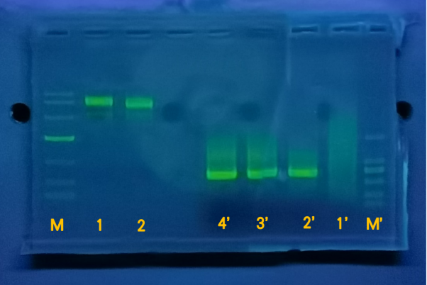
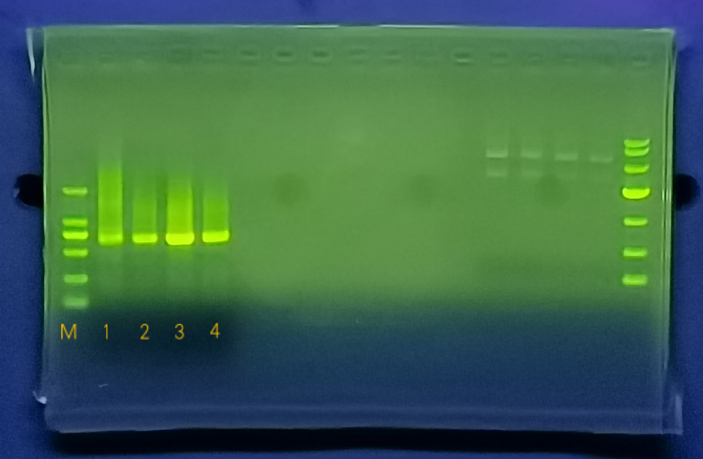
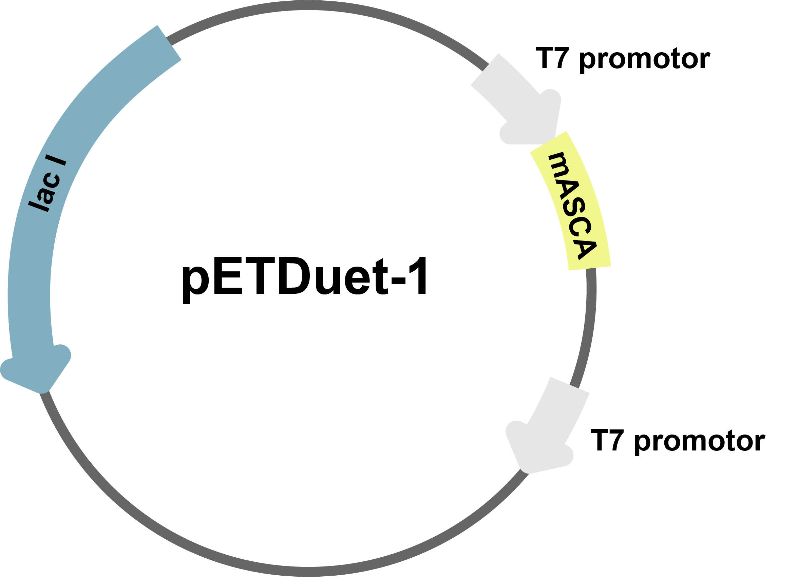
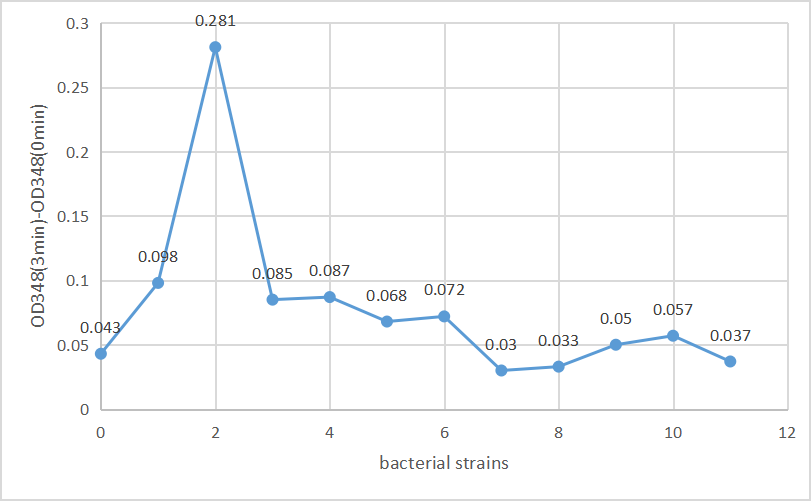

# Analysis of error-prone PCR results

<b>1. Condition optimization of error-prone PCR</b>

Controlled error-prone PCR Kit (No. ZY-160903) was used to preform sequential error-prone PCR on mASCA. The initial set of number of cycles is 45 and the expected mutation value is 6 per 1000bp. The results of error-prone PCR products after agarose gel electrophoresis are shown in Fig.1a. The products was digested sequentially with EcoRⅠand HindⅢ and ligated into the corresponding sites of the pETDuet-1 plasmid to construct the vector( Fig.1b) and the vector was transformed into E. coli BL21. It is possible that too many cycles resulted in an increase of non-specific products and therefore failed to be transformed into E. coli. After changing the number of cycles to 35, the error-prone PCR products were successfully transformed into E. coli BL21 (Fig.1c).

{ width=400px }

*Fig.1a* <b>Product electrophoresis results (45 circles)</b> 

M: Marker10000  
1: Plasmid pETDuet-1 electrophoresis product  
2: Plasmid pETDuet-1 electrophoresis product
M’: Marker2000  
1’: Error-prone PCR products with a concentration of 1ng/μL as template  
2’：Error-prone PCR products with a concentration of 1ng/μL as template  
3’：Error-prone PCR products with a concentration of 10ng/μL as template  
4’：Error-prone PCR products with a concentration of 10ng/μL

No.0 is the original bacterial strain while the No.1 to No.11 are the mutant bacterial strains. The y-axis of the chart is OD348(3min) -OD348(0min), which represents the activity of recombinase. The enzyme activity of original strain was 0.043, and 6 of the 10 strains we obtained increased enzyme activity. Among them, the activity of enzyme No.2 was significantly increased, changing from 0.043 to 0.281, and the activity of enzyme increased by about 6 times. In conclusion, we obtained an enzyme with significantly improved activity by error-prone PCR. We will sequence its corresponding gene fragment to find out the changes, and will analyze the changes in the secondary structure and tertiary structure of the protein to elaborate the reason for its enzyme activity improvement.

{ width=400px }

*Fig.1b* <b>Product electrophoresis results (35 circles)</b> 

M: Marker2000  
1: Error-prone PCR products with a concentration of 1ng/μL as template  
2：Error-prone PCR products with a concentration of 1ng/μL as template  
3：Error-prone PCR products with a concentration of 10ng/μL as template  
4：Error-prone PCR products with a concentration of 10ng/μL

{ width=300px }

*Fig.1c* <b>Plasmids for mutant constructs (35 circles)</b> 

{ width=500px }

*Fig.2a* <b>Values of the enzyme expressed by the mutant bacterial strains and by the original bacterial strain.</b> 

