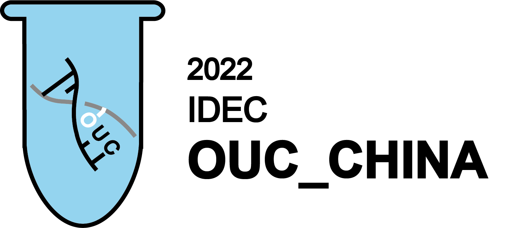

# iDEC 2022 | OUC_China

 <b>Directed evolution of carbonic anhydrase to improve microbial induced calcium carbonate precipitation (MICP) efficienc</b>

***

>This wiki template was built using [Material for MkDocs](https://squidfunk.github.io/mkdocs-material/). You are by no means confined to use this template. In fact, you are encouraged to build your own unique **static site** that best suits your project, and you are free to use any framework you like. 
 
Should you decide to use this wiki, however, we have a [tutorial](https://wiki.idec.io/team_wiki/mkdocs/) to walk you through the basics.

Microbial induced calcium carbonate precipitation (MICP) is an environmentally friendly way to produce inorganic material, and it`s considered as a feasible approach to resolve pollution problem and incompatible surface of inorganic and organic materials in repairation of concrete and soil. Urease and carbonic anhydrase are two key enzymes in MICP, which cooperate in the process. We express carbonic anhydrase in Escherichia coli and modify it by error-prone PCR, which is a widely used directed evolution technique. We obtain several mutants and measure their enzyme activity successfully. The structure of these mutants was predicted and analysed by means of bioinformatics.

