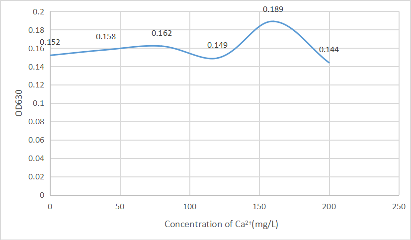
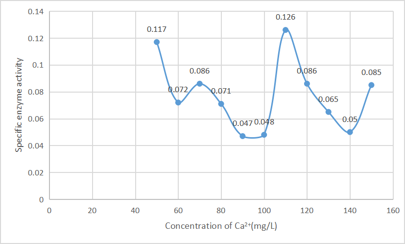

# Analysis of physical and chemical properties of mASCA

<b>1. Analysis of the optimum Ca2+ concentra- tion for mASCA expression</b>

According to Fig.1, the change of Ca2+ concentration has no linear influence on the growth of bacteria, and different concentrations have little influence on the growth of bacteria. Therefore, the influence of the change of Ca2+ concentration on the amount of bacteria can be ignored. However, different concentrations of calcium ions have certain effects on the specific activity of carbonic anhydrase. According to our Fig.2, when the Ca2+ concentration was 110mg/L, the specific enzyme activity was the highest. In conclusion, 110mg/L Ca2+ concentration should be selected as the value of the subsequent evolution and expression process as the most suitable choice.

{ width=500px }

*Fig.1* <b>Effect of Ca2+ concentration on bacterial growth</b> 

{ width=500px }

*Fig.2* <b>Effect of Ca2+ concentration on bacterial growth</b> 
