# OUC-CHINA

<b>Team Leader </b>

---

<b>Zixiang Zhong</b> 
 
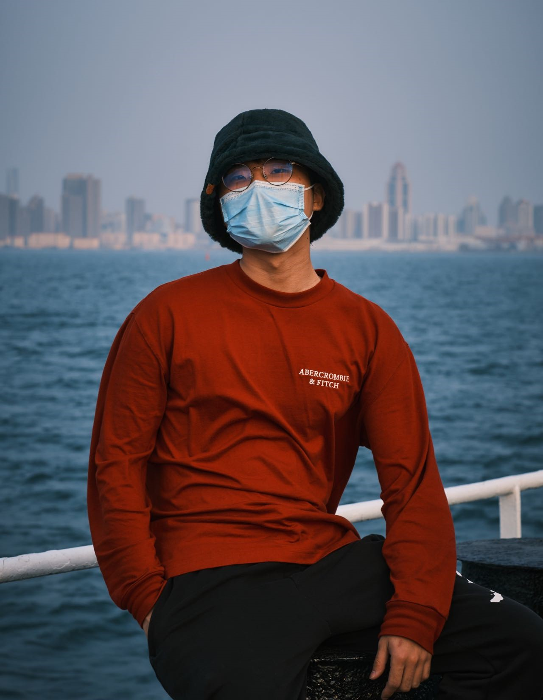{ width=200px } 
 
Zixiang Zhong, a junior of OUC, who is an entry-level photography enthusiast, likes to see the sea at sunrise, likes sunny or snowy days, and hates rainy days. He is the captain of this year's OUC_China and a member of the last iDEC team. It is the first time he acts as a team leader. A tough trying, but he still enjoy it.  He plans to study for doctorate next year—— as for the major, he is now interested in the development and evolution of protozoa, but who knows what the future holds?

 

<b>Team Players</b> 

---

<b>Duo Hou</b> 
 
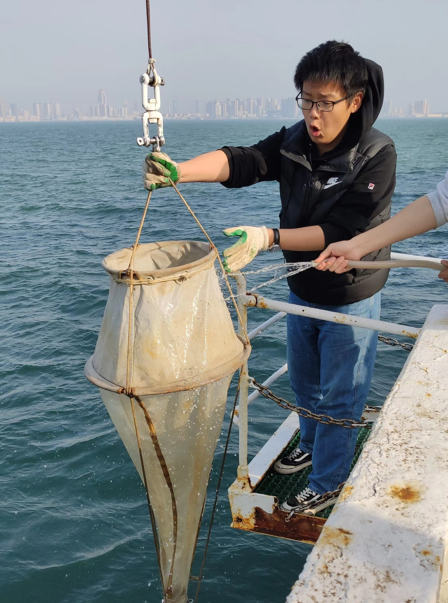{ width=200px } 
 
Duo Hou, a college student majoring in biological sciences. Although the major is keeping him from getting a job, he still loves it deeply. "I think you do too", he said. Let's burn our lives together for life science.

<b>Haoran Wang</b> 
 
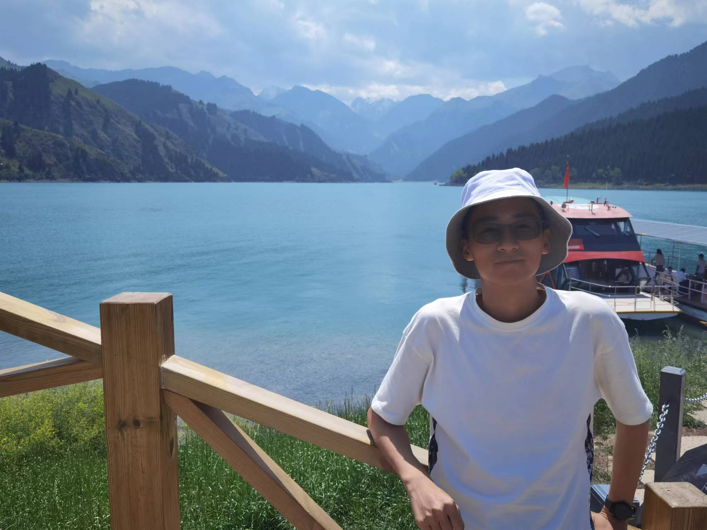{ width=250px } 
 
Haoran Wang, a junior student in Ocean University of China, majors in Biological Science. Interested in genetics and molecular biology, he joined the university's key laboratory of marine genetics and breeding in his sophomore year. He is currently involved in breeding Mulinia Lateralis and screening their genes for temperature tolerance traits. It was by chance that he learnt about this competition from schoolmate and decided to learn more about these interesting directed evolutionary systems.

<b>Jingting Hao</b> 
 
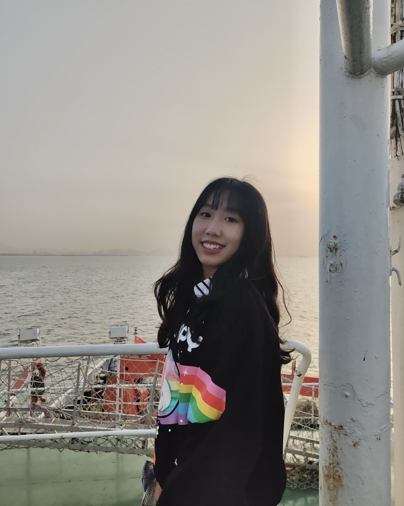{ width=200px } 
 
Jingting Hao, a senior student majoring in biotechnology in College of Marine Life, Ocean University of China. As a student who loves biological experiments, Jingting Hao has been studying and engaging in scientific research since her freshman year. She enjoys the challenges and the exploration of the internal mechanisms of various organisms. In the future, she hopes to continue her research on microorganisms. 

<b>Shuhan Yang</b> 
 
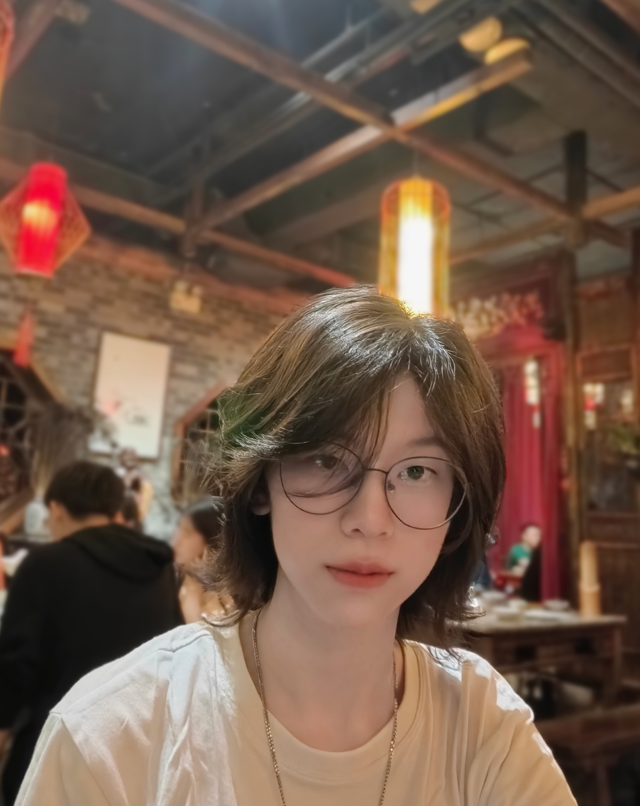{ width=200px } 
 
Shuhan Yang, a senior student in Ocean University of China, majoring in Biological Science. Since the first year of her college life, she has been determined to scientific research of biology. So she began to engage in experiments with some theoretical basis to achieve this goal. She believes that using the power of nature to achieve our scientific targets is cool.

<b>Zhenquan Deng</b> 
 
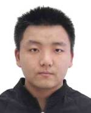{ width=200px } 
 
Zhenquan Deng, a senior student who majors in life science at Ocean University of China. Because of great curiosity about the mechanism behind life phenomena, he joined the Biotechnology Association in his freshman year. After one year of community activities, he learned about small realms of life science extensively, and carried out microbiological experiments under the guidance of Mr. Wang in his sophomore and junior year. In these processes, he learned a lot of experimental skills and perspectives of thinking. These gains is one of the reasons why he feels the life science is full of charms. He is mainly responsible for the PCR primer design.

<b>Zhiyi Li</b> 
 
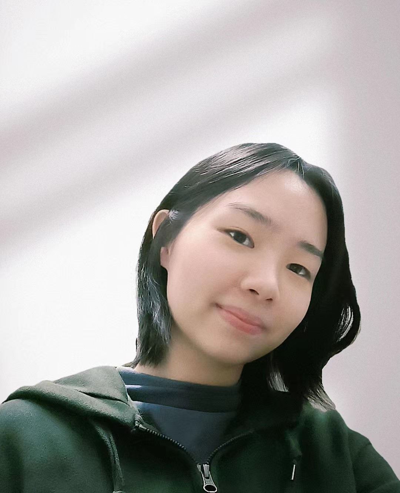{ width=200px } 
 
Zhiyi is a  senior student from Ocean University of China, majoring in Biological Science. As infp, she found that it's more interesting to learn something new. So she learnt Python and deep learning. She also likes drawing. Therefore, she was mainly responsible for wiki editing and illustrations this time. 

<b>Xingyao Chang</b> 
 
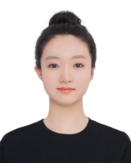{ width=200px } 
 
Xinyao Chang，a undergraduate majoring in biological science in ocean university of China. In her second year of college, she joined the first scientific research project which focused on isolating and culturing the bacteria that can degrade alkane and aromatic hydrocarbon from cold seep environment. In the same time, she participated idec team because of the interest for directed evolution，hope that accumulating more scientific research experience.

<b>Wei Wei</b> 
 
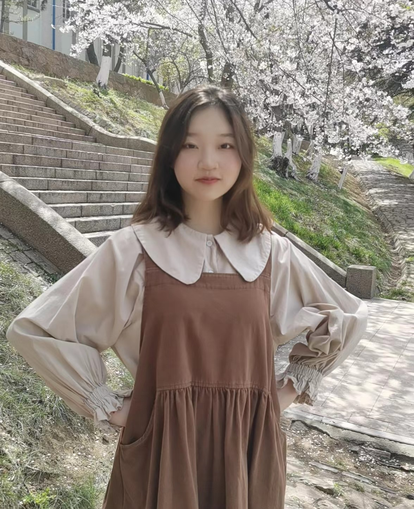{ width=200px } 
 
Wei Wei is a junior student majoring in Biological science in College of Marine Life, Ocean University of China.And she's eager to challenge something new. From this experience, She learned a lot. Now She's interested in cell biology and hope to do research in this direction in the future. 

<b>Hongze Wu</b> 
 
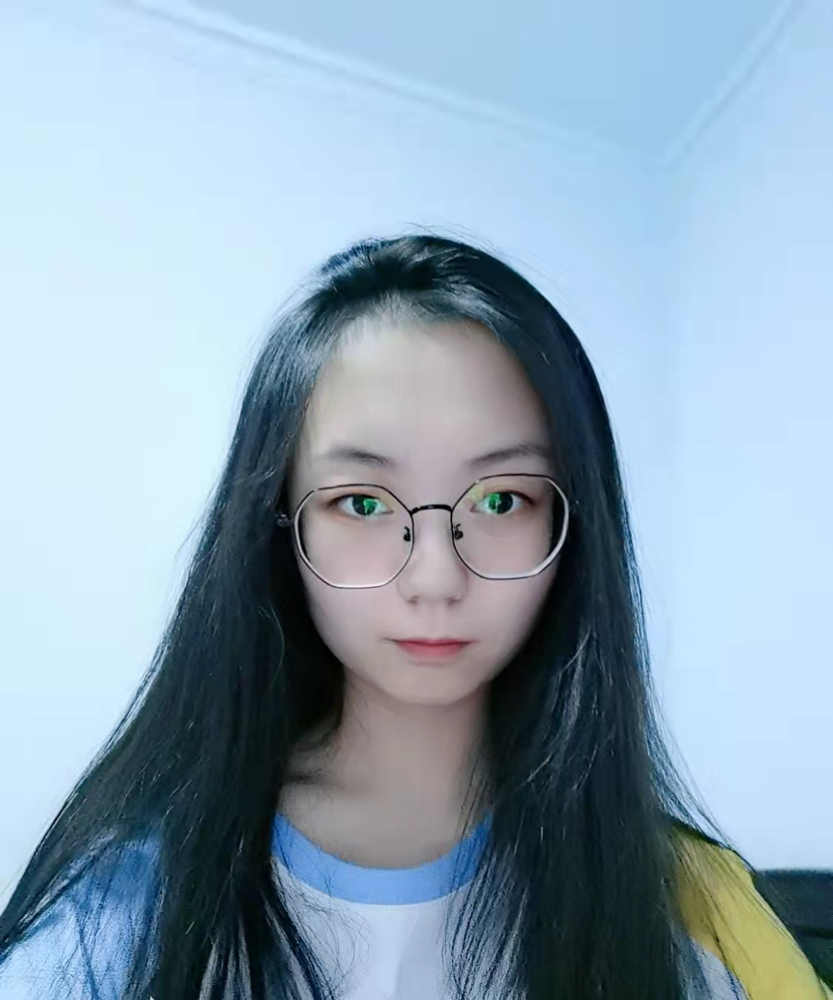{ width=200px } 
 
Hongze Wu is studying Biology Science in College of Marine Life, Ocean University of China. 
Her interests include molecular biology, microbiology and genetics. As an undergraduate, she is excited about learning more technologies. This experience has deeply increased her passion for science.  She plan to pursue a graduate degree in biological science.

<b>Jiawen Lin</b> 
 
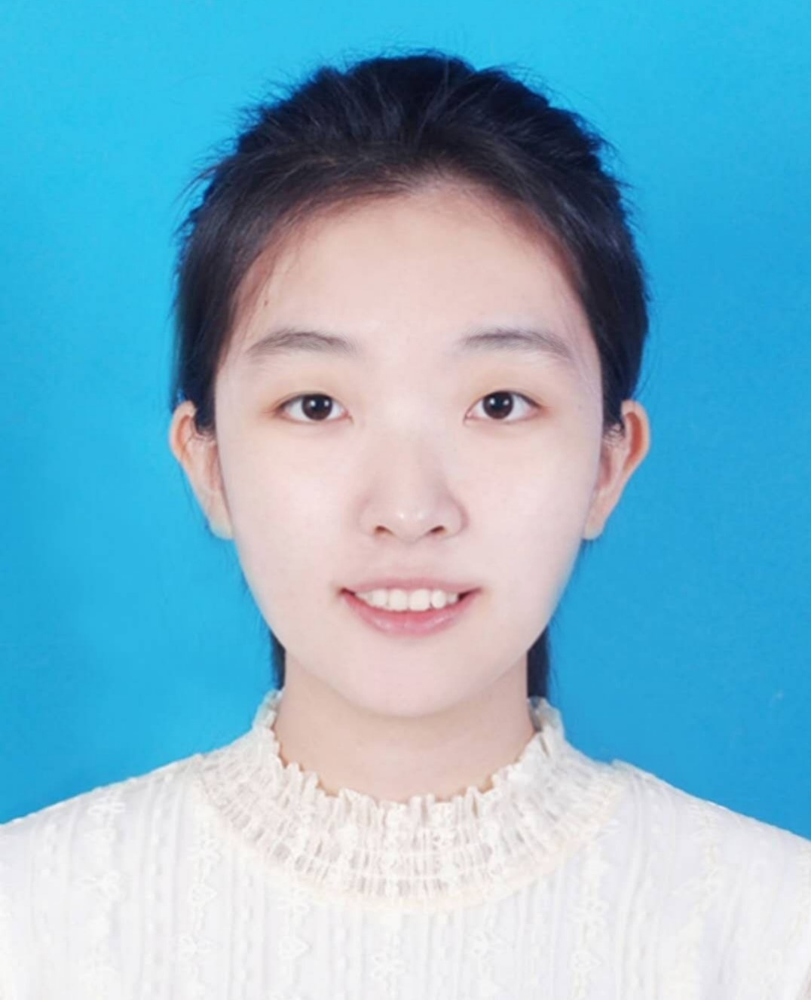{ width=200px } 
 
Lin Jiawen.She is a junior student majoring in Biological science in Colege of Marine Life , Ocean University of China. In her sophomore year, she entered the laboratory to improve her professional knowledge and learn experimental skills, and she has a strong interest in scientific research. She is eager to try different research projects in the field of biology and find the research direction she is  interested in. She hopes to contribute to the progress of biological science in the future.

 

<b>Tutor</b> 

---

<b>Xianghong Wang</b> 
 
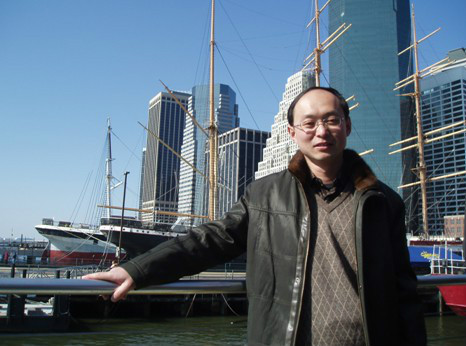{ width=200px } 
 
Xianghong Wang, Ph.D., senior engineer, master tutor, graduated from The Department of Marine Biology, Ocean University of China, deputy director of the Marine Life Science Experimental Teaching Demonstration Center, Ocean University of China, and secretary of the Party Branch of the Center. His research interests include Marine yeast resources, physiology and biochemistry, genetics and application, Marine beneficial bacteria, Marine bacterial diversity and active substances.